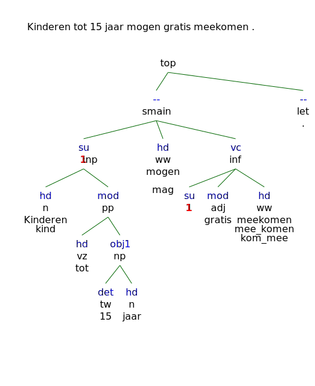

# posm_dataset_maker

Makes datasets with part-of-speech-tagged sentences.

## Setup
Download and unpack the [Lassy Klein-corpus](https://taalmaterialen.ivdnt.org/download/lassy-klein-corpus7/) to a directory of your choice.

Add a `.env` in and add the following variables with the appropriate values:

```dotenv
TREEBANK_DIR="path/to/the/Lassy/Treebank/directory/"
```

## Result Dataset Format

A dataset is a directory that contains multiple json-files, one for each document, and
one `_metadata.json` file. Each document json-file contains a dictionary with two keys:

- `doc`: the document ID
- `data`: a dictionary that maps sentence IDs to sentence data dictionaries

Each sentence data dictionary contains two keys:

- `pos_nl`: a list of lists, each of which contains two elements, a word and the Dutch
  POS-tags for that word, in the order in the respective sentence
- `sentence`: the full sentence

### Example

```json
{
 "data": {
  "p.17.s.3": {
   "pos_nl": [
    [
     "Kinderen",
     "n"
    ],
    [
     "tot",
     "vz"
    ],
    [
     "15",
     "tw"
    ],
    [
     "jaar",
     "n"
    ],
    [
     "mogen",
     "ww"
    ],
    [
     "gratis",
     "adj"
    ],
    [
     "meekomen",
     "ww"
    ],
    [
     ".",
     "let"
    ]
   ],
   "sentence": "Kinderen tot 15 jaar mogen gratis meekomen ."
  },
  "p.17.s.4": {
   "pos_nl": [
    [
     "De",
     "lid"
    ],
    [
     "laatste",
     "adj"
    ],
    [
     "optredens",
     "n"
    ],
    [
     "zijn",
     "ww"
    ],
    [
     "voorzien",
     "ww"
    ],
    [
     "rond",
     "vz"
    ],
    [
     "21u00",
     "spec"
    ],
    [
     ".",
     "let"
    ]
   ],
   "sentence": "De laatste optredens zijn voorzien rond 21u00 ."
  }
 },
 "doc": "WR-P-E-C-0000000004"
}
```

## Example Tree from the Lassy Small Corpus

- Sentence: "Kinderen tot 15 jaar mogen gratis meekomen."
- Source: `WR-P-E-C-0000000004/WR-P-E-C-0000000004.p.17.s.3.xml`

```xml
<?xml version="1.0" encoding="UTF-8"?>
<alpino_ds version="1.3">
  <node begin="0" cat="top" end="8" id="0" rel="top">
    <node begin="0" cat="smain" end="7" id="1" rel="--">
      <node begin="0" cat="np" end="4" id="2" index="1" rel="su">
        <node begin="0" end="1" getal="mv" graad="basis" id="3" lemma="kind" ntype="soort" pos="noun" postag="N(soort,mv,basis)" pt="n" rel="hd" root="kind" word="Kinderen"/>
        <node begin="1" cat="pp" end="4" id="4" rel="mod">
          <node begin="1" end="2" id="5" lemma="tot" pos="prep" postag="VZ(init)" pt="vz" rel="hd" root="tot" vztype="init" word="tot"/>
          <node begin="2" cat="np" end="4" id="6" rel="obj1">
            <node begin="2" end="3" id="7" lemma="15" naamval="stan" numtype="hoofd" pos="num" positie="prenom" postag="TW(hoofd,prenom,stan)" pt="tw" rel="det" root="15" word="15"/>
            <node begin="3" end="4" genus="onz" getal="ev" graad="basis" id="8" lemma="jaar" naamval="stan" ntype="soort" pos="noun" postag="N(soort,ev,basis,onz,stan)" pt="n" rel="hd" root="jaar" word="jaar"/>
          </node>
        </node>
      </node>
      <node begin="4" end="5" id="9" lemma="mogen" pos="verb" postag="WW(pv,tgw,mv)" pt="ww" pvagr="mv" pvtijd="tgw" rel="hd" root="mag" word="mogen" wvorm="pv"/>
      <node begin="0" cat="inf" end="7" id="10" rel="vc">
        <node begin="0" end="4" id="11" index="1" rel="su"/>
        <node begin="5" buiging="zonder" end="6" graad="basis" id="12" lemma="gratis" pos="adj" positie="vrij" postag="ADJ(vrij,basis,zonder)" pt="adj" rel="mod" root="gratis" word="gratis"/>
        <node begin="6" buiging="zonder" end="7" id="13" lemma="mee_komen" pos="verb" positie="vrij" postag="WW(inf,vrij,zonder)" pt="ww" rel="hd" root="kom_mee" word="meekomen" wvorm="inf"/>
      </node>
    </node>
    <node begin="7" end="8" id="14" lemma="." pos="punct" postag="LET()" pt="let" rel="--" root="." word="."/>
  </node>
  <sentence>Kinderen tot 15 jaar mogen gratis meekomen .</sentence>
</alpino_ds>
```



